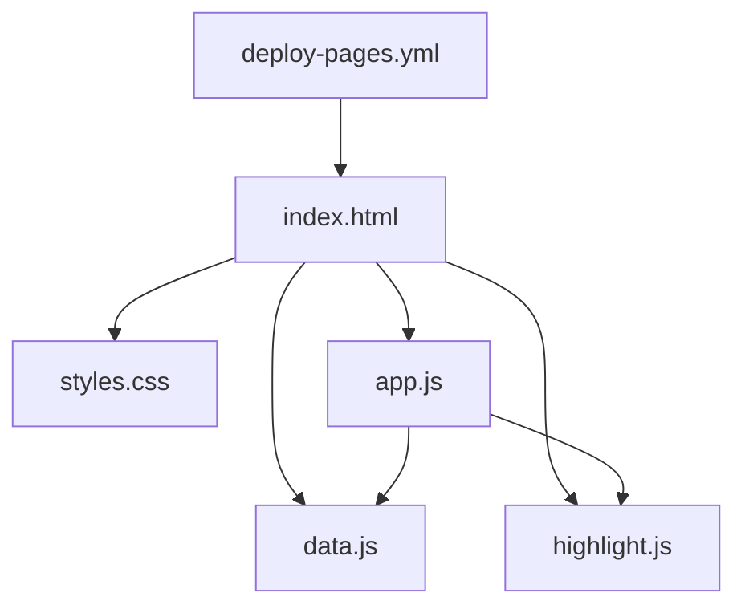

## 1. Stack
- Plain HTML/CSS/JavaScript — no framework, no build step, no dependencies, no external CDNs (README.md).
- Static site, designed to run as-is via `file://` or any static server (README.md).
- Deployed via GitHub Pages using a GitHub Actions workflow (.github/workflows/deploy-pages.yml).
- `.nojekyll` present so GitHub Pages serves `assets/` untouched (README.md).

## 2. Directory map
| path | what lives there |
|---|---|
| index.html | Page shell — DOM skeleton, script/style includes |
| assets/css/styles.css | Design system (light + dark), layout, components |
| assets/js/data.js | Full guide content — single source of truth (22 sections, blocks + qa) |
| assets/js/highlight.js | Self-contained syntax highlighter |
| assets/js/app.js | Rendering + checklist/progress/search/theme/flashcards logic |
| .github/workflows/deploy-pages.yml | GitHub Pages deploy workflow |
| .claude/launch.json | Claude Code launch config |

## 3. Diagram

## 4. Component index
- [[index.html]]
- [[styles.css]]
- [[data.js]]
- [[highlight.js]]
- [[app.js]]
- [[deploy-pages.yml]]

## 5. Entry points
- Dev: `python3 -m http.server 8000` from repo root, then open `http://localhost:8000/` (README.md). Also works by double-clicking `index.html` (file://) (README.md).
- Prod: GitHub Pages, branch `main`, folder `/ (root)`, live at `https://alphaman-0.github.io/WordPress/` (README.md), built by `.github/workflows/deploy-pages.yml`.

## 6. Conventions
- No build step, no dependencies, no external CDNs — plain HTML/CSS/JS only (README.md).
- All study content lives in `assets/js/data.js`; each section is an object with `blocks` (prose, code, tables, callouts) and `qa` (question/answer cards) (README.md).
- Prose in `data.js` supports inline markup: `` `inline code` ``, `**bold**`, `*italic*` (README.md).
- Adding a section to `data.js` automatically produces its TOC entry, checkboxes, progress tracking, and search — "no other changes needed" (README.md).
- `index.html` exposes stable element `id`s (e.g. `toc`, `sections`, `search`, `progressFill`, `tierBadge`) as hooks for `app.js` to render into (index.html).
- Scripts are loaded in fixed order in `index.html`: `data.js`, then `highlight.js`, then `app.js` (index.html).

## 7. Where things go
- Add a new study section: edit `assets/js/data.js`, add a section object with `blocks`/`qa` (README.md).
- Change visual design/theme (light/dark): edit `assets/css/styles.css`.
- Change interactive behavior (search, flashcards, checklist, progress, theme toggle): edit `assets/js/app.js`.
- Change code-sample highlighting rules: edit `assets/js/highlight.js`.
- Change deploy branch/folder/trigger: edit `.github/workflows/deploy-pages.yml`.
